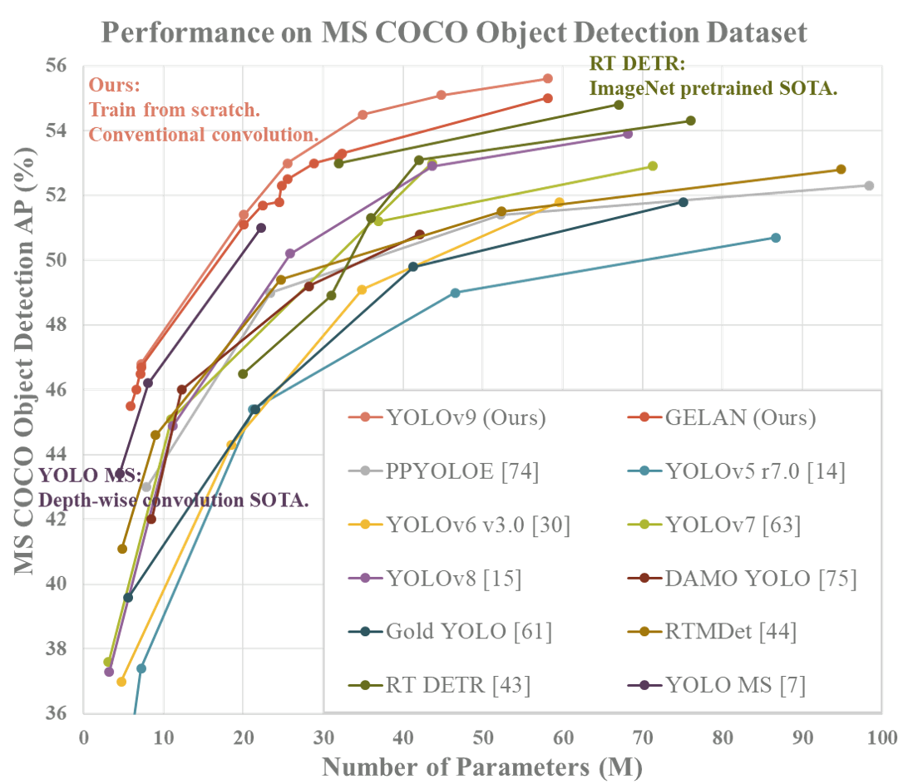
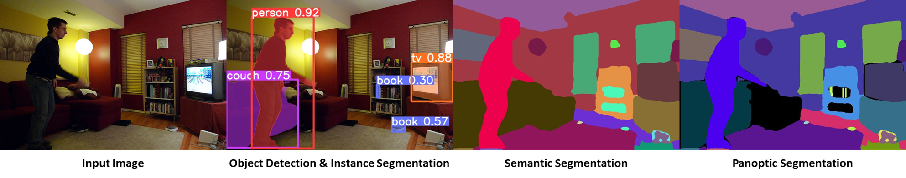

# YOLOv9

Implementation of paper - [YOLOv9: Learning What You Want to Learn Using Programmable Gradient Information](https://arxiv.org/abs/2402.13616)

[](https://arxiv.org/abs/2402.13616)
[](https://huggingface.co/spaces/kadirnar/Yolov9)
[](https://huggingface.co/merve/yolov9)
[](https://colab.research.google.com/github/roboflow-ai/notebooks/blob/main/notebooks/train-yolov9-object-detection-on-custom-dataset.ipynb)
[](https://learnopencv.com/yolov9-advancing-the-yolo-legacy/)

<div align="center">
    <a href="./">
        
    </a>
</div>


## Performance 

MS COCO

| Model | Test Size | AP<sup>val</sup> | AP<sub>50</sub><sup>val</sup> | AP<sub>75</sub><sup>val</sup> | Param. | FLOPs |
| :-- | :-: | :-: | :-: | :-: | :-: | :-: |
| [**YOLOv9-N (dev)**]() | 640 | **38.3%** | **53.1%** | **41.3%** | **2.0M** | **7.7G** |
| [**YOLOv9-S**]() | 640 | **46.8%** | **63.4%** | **50.7%** | **7.1M** | **26.4G** |
| [**YOLOv9-M**]() | 640 | **51.4%** | **68.1%** | **56.1%** | **20.0M** | **76.3G** |
| [**YOLOv9-C**](https://github.com/WongKinYiu/yolov9/releases/download/v0.1/yolov9-c-converted.pt) | 640 | **53.0%** | **70.2%** | **57.8%** | **25.3M** | **102.1G** |
| [**YOLOv9-E**](https://github.com/WongKinYiu/yolov9/releases/download/v0.1/yolov9-e-converted.pt) | 640 | **55.6%** | **72.8%** | **60.6%** | **57.3M** | **189.0G** |

<!-- small and medium models will be released after the paper be accepted and published. -->

## Useful Links

<details><summary> <b>Expand</b> </summary>

Custom training: https://github.com/WongKinYiu/yolov9/issues/30#issuecomment-1960955297
    
ONNX export: https://github.com/WongKinYiu/yolov9/issues/2#issuecomment-1960519506 https://github.com/WongKinYiu/yolov9/issues/40#issue-2150697688 https://github.com/WongKinYiu/yolov9/issues/130#issue-2162045461

TensorRT inference: https://github.com/WongKinYiu/yolov9/issues/143#issuecomment-1975049660 https://github.com/WongKinYiu/yolov9/issues/34#issue-2150393690 https://github.com/WongKinYiu/yolov9/issues/79#issue-2153547004 https://github.com/WongKinYiu/yolov9/issues/143#issue-2164002309

OpenVINO: https://github.com/WongKinYiu/yolov9/issues/164#issue-2168540003

C# ONNX inference: https://github.com/WongKinYiu/yolov9/issues/95#issue-2155974619

C# OpenVINO inference: https://github.com/WongKinYiu/yolov9/issues/95#issuecomment-1968131244

OpenCV: https://github.com/WongKinYiu/yolov9/issues/113#issuecomment-1971327672

Hugging Face demo: https://github.com/WongKinYiu/yolov9/issues/45#issuecomment-1961496943

CoLab demo: https://github.com/WongKinYiu/yolov9/pull/18

ONNXSlim export: https://github.com/WongKinYiu/yolov9/pull/37

YOLOv9 ROS: https://github.com/WongKinYiu/yolov9/issues/144#issue-2164210644

YOLOv9 ROS TensorRT: https://github.com/WongKinYiu/yolov9/issues/145#issue-2164218595

YOLOv9 Julia: https://github.com/WongKinYiu/yolov9/issues/141#issuecomment-1973710107

YOLOv9 ByteTrack: https://github.com/WongKinYiu/yolov9/issues/78#issue-2153512879

YOLOv9 DeepSORT: https://github.com/WongKinYiu/yolov9/issues/98#issue-2156172319

YOLOv9 counting: https://github.com/WongKinYiu/yolov9/issues/84#issue-2153904804

YOLOv9 face detection: https://github.com/WongKinYiu/yolov9/issues/121#issue-2160218766

YOLOv9 segmentation onnxruntime: https://github.com/WongKinYiu/yolov9/issues/151#issue-2165667350

Comet logging: https://github.com/WongKinYiu/yolov9/pull/110

MLflow logging: https://github.com/WongKinYiu/yolov9/pull/87

AnyLabeling tool: https://github.com/WongKinYiu/yolov9/issues/48#issue-2152139662

AX650N deploy: https://github.com/WongKinYiu/yolov9/issues/96#issue-2156115760

Conda environment: https://github.com/WongKinYiu/yolov9/pull/93

AutoDL docker environment: https://github.com/WongKinYiu/yolov9/issues/112#issue-2158203480

</details>


## Installation

Docker environment (recommended)
<details><summary> <b>Expand</b> </summary>

``` shell
# create the docker container, you can change the share memory size if you have more.
nvidia-docker run --name yolov9 -it -v your_coco_path/:/coco/ -v your_code_path/:/yolov9 --shm-size=64g nvcr.io/nvidia/pytorch:21.11-py3

# apt install required packages
apt update
apt install -y zip htop screen libgl1-mesa-glx

# pip install required packages
pip install seaborn thop

# go to code folder
cd /yolov9
```

</details>


## Evaluation

[`yolov9-c-converted.pt`](https://github.com/WongKinYiu/yolov9/releases/download/v0.1/yolov9-c-converted.pt) [`yolov9-e-converted.pt`](https://github.com/WongKinYiu/yolov9/releases/download/v0.1/yolov9-e-converted.pt) [`yolov9-c.pt`](https://github.com/WongKinYiu/yolov9/releases/download/v0.1/yolov9-c.pt) [`yolov9-e.pt`](https://github.com/WongKinYiu/yolov9/releases/download/v0.1/yolov9-e.pt) [`gelan-c.pt`](https://github.com/WongKinYiu/yolov9/releases/download/v0.1/gelan-c.pt) [`gelan-e.pt`](https://github.com/WongKinYiu/yolov9/releases/download/v0.1/gelan-e.pt)

``` shell
# evaluate converted yolov9 models
python val.py --data data/coco.yaml --img 640 --batch 32 --conf 0.001 --iou 0.7 --device 0 --weights './yolov9-c-converted.pt' --save-json --name yolov9_c_c_640_val

# evaluate yolov9 models
#python val_dual.py --data data/coco.yaml --img 640 --batch 32 --conf 0.001 --iou 0.7 --device 0 --weights './yolov9-c.pt' --save-json --name yolov9_c_640_val

# evaluate gelan models
# python val.py --data data/coco.yaml --img 640 --batch 32 --conf 0.001 --iou 0.7 --device 0 --weights './gelan-c.pt' --save-json --name gelan_c_640_val
```

You will get the results:

```
 Average Precision  (AP) @[ IoU=0.50:0.95 | area=   all | maxDets=100 ] = 0.530
 Average Precision  (AP) @[ IoU=0.50      | area=   all | maxDets=100 ] = 0.702
 Average Precision  (AP) @[ IoU=0.75      | area=   all | maxDets=100 ] = 0.578
 Average Precision  (AP) @[ IoU=0.50:0.95 | area= small | maxDets=100 ] = 0.362
 Average Precision  (AP) @[ IoU=0.50:0.95 | area=medium | maxDets=100 ] = 0.585
 Average Precision  (AP) @[ IoU=0.50:0.95 | area= large | maxDets=100 ] = 0.693
 Average Recall     (AR) @[ IoU=0.50:0.95 | area=   all | maxDets=  1 ] = 0.392
 Average Recall     (AR) @[ IoU=0.50:0.95 | area=   all | maxDets= 10 ] = 0.652
 Average Recall     (AR) @[ IoU=0.50:0.95 | area=   all | maxDets=100 ] = 0.702
 Average Recall     (AR) @[ IoU=0.50:0.95 | area= small | maxDets=100 ] = 0.541
 Average Recall     (AR) @[ IoU=0.50:0.95 | area=medium | maxDets=100 ] = 0.760
 Average Recall     (AR) @[ IoU=0.50:0.95 | area= large | maxDets=100 ] = 0.844
```


## Training

Data preparation

``` shell
bash scripts/get_coco.sh
```

* Download MS COCO dataset images ([train](http://images.cocodataset.org/zips/train2017.zip), [val](http://images.cocodataset.org/zips/val2017.zip), [test](http://images.cocodataset.org/zips/test2017.zip)) and [labels](https://github.com/WongKinYiu/yolov7/releases/download/v0.1/coco2017labels-segments.zip). If you have previously used a different version of YOLO, we strongly recommend that you delete `train2017.cache` and `val2017.cache` files, and redownload [labels](https://github.com/WongKinYiu/yolov7/releases/download/v0.1/coco2017labels-segments.zip) 

Single GPU training

``` shell
# train yolov9 models
python train_dual.py --workers 8 --device 0 --batch 16 --data data/coco.yaml --img 640 --cfg models/detect/yolov9-c.yaml --weights '' --name yolov9-c --hyp hyp.scratch-high.yaml --min-items 0 --epochs 500 --close-mosaic 15

# train gelan models
# python train.py --workers 8 --device 0 --batch 32 --data data/coco.yaml --img 640 --cfg models/detect/gelan-c.yaml --weights '' --name gelan-c --hyp hyp.scratch-high.yaml --min-items 0 --epochs 500 --close-mosaic 15
```

Multiple GPU training

``` shell
# train yolov9 models
python -m torch.distributed.launch --nproc_per_node 8 --master_port 9527 train_dual.py --workers 8 --device 0,1,2,3,4,5,6,7 --sync-bn --batch 128 --data data/coco.yaml --img 640 --cfg models/detect/yolov9-c.yaml --weights '' --name yolov9-c --hyp hyp.scratch-high.yaml --min-items 0 --epochs 500 --close-mosaic 15

# train gelan models
# python -m torch.distributed.launch --nproc_per_node 4 --master_port 9527 train.py --workers 8 --device 0,1,2,3 --sync-bn --batch 128 --data data/coco.yaml --img 640 --cfg models/detect/gelan-c.yaml --weights '' --name gelan-c --hyp hyp.scratch-high.yaml --min-items 0 --epochs 500 --close-mosaic 15
```


## Re-parameterization

See [reparameterization.ipynb](https://github.com/WongKinYiu/yolov9/blob/main/tools/reparameterization.ipynb).


## Citation

```
@article{wang2024yolov9,
  title={{YOLOv9}: Learning What You Want to Learn Using Programmable Gradient Information},
  author={Wang, Chien-Yao  and Liao, Hong-Yuan Mark},
  booktitle={arXiv preprint arXiv:2402.13616},
  year={2024}
}
```

```
@article{chang2023yolor,
  title={{YOLOR}-Based Multi-Task Learning},
  author={Chang, Hung-Shuo and Wang, Chien-Yao and Wang, Richard Robert and Chou, Gene and Liao, Hong-Yuan Mark},
  journal={arXiv preprint arXiv:2309.16921},
  year={2023}
}
```


## Teaser

Parts of code of [YOLOR-Based Multi-Task Learning](https://arxiv.org/abs/2309.16921) are released in the repository.

<div align="center">
    <a href="./">
        
    </a>
</div>

#### Object Detection

``` shell
# coco/labels/{split}/*.txt
# bbox or polygon (1 instance 1 line)
python train.py --workers 8 --device 0 --batch 32 --data data/coco.yaml --img 640 --cfg models/detect/gelan-c.yaml --weights '' --name gelan-c-det --hyp hyp.scratch-high.yaml --min-items 0 --epochs 300 --close-mosaic 10
```

#### Instance Segmentation

``` shell
# coco/labels/{split}/*.txt
# polygon (1 instance 1 line)
python segment/train.py --workers 8 --device 0 --batch 32  --data coco.yaml --img 640 --cfg models/segment/gelan-c-seg.yaml --weights '' --name gelan-c-seg --hyp hyp.scratch-high.yaml --epochs 300 --close-mosaic 10 --no-overlap
```

#### Panoptic Segmentation

``` shell
# coco/labels/{split}/*.txt
# polygon (1 instance 1 line)
# coco/stuff/{split}/*.txt
# polygon (1 semantic 1 line)
python panoptic/train.py --workers 8 --device 0 --batch 32  --data coco.yaml --img 640 --cfg models/panoptic/gelan-c-pan.yaml --weights '' --name gelan-c-pan --hyp hyp.scratch-high.yaml --epochs 300 --close-mosaic 10 --no-overlap
```

#### Image Captioning (not yet released)

``` shell
# coco/labels/{split}/*.txt
# polygon (1 instance 1 line)
# coco/stuff/{split}/*.txt
# polygon (1 semantic 1 line)
# coco/annotations/*.json
# json (1 split 1 file)
python caption/train.py --workers 8 --device 0 --batch 32  --data coco.yaml --img 640 --cfg models/caption/gelan-c-cap.yaml --weights '' --name gelan-c-cap --hyp hyp.scratch-high.yaml --epochs 300 --close-mosaic 10 --no-overlap
```


## Acknowledgements

<details><summary> <b>Expand</b> </summary>

* [https://github.com/AlexeyAB/darknet](https://github.com/AlexeyAB/darknet)
* [https://github.com/WongKinYiu/yolor](https://github.com/WongKinYiu/yolor)
* [https://github.com/WongKinYiu/yolov7](https://github.com/WongKinYiu/yolov7)
* [https://github.com/VDIGPKU/DynamicDet](https://github.com/VDIGPKU/DynamicDet)
* [https://github.com/DingXiaoH/RepVGG](https://github.com/DingXiaoH/RepVGG)
* [https://github.com/ultralytics/yolov5](https://github.com/ultralytics/yolov5)
* [https://github.com/meituan/YOLOv6](https://github.com/meituan/YOLOv6)

</details>
