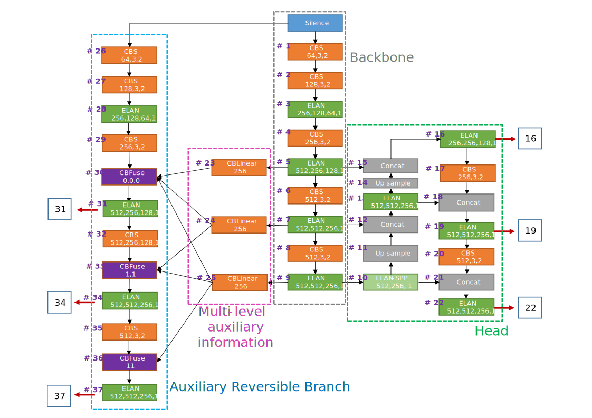
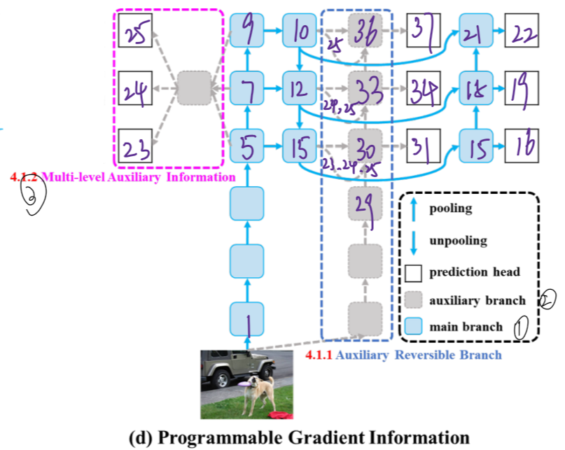
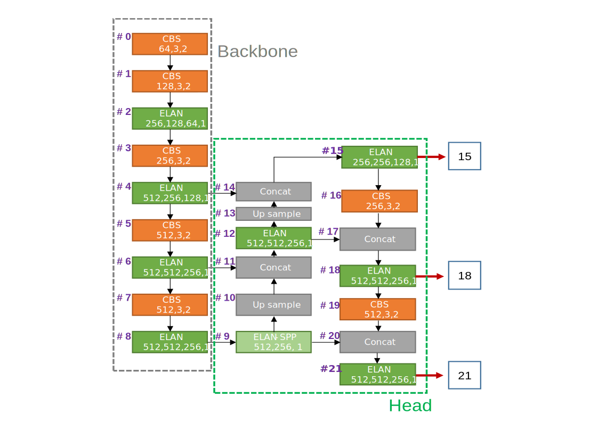
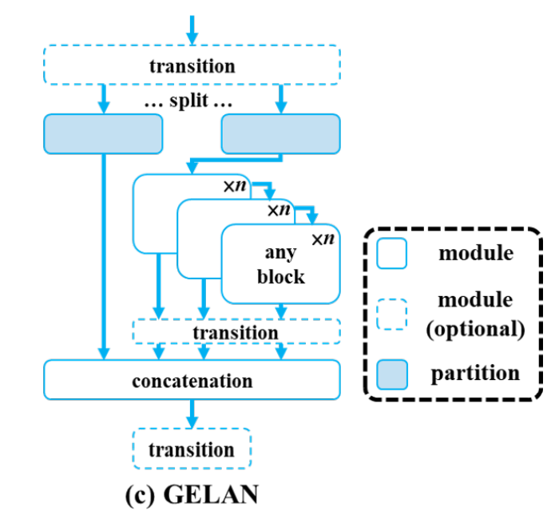
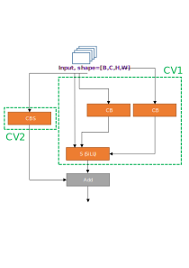

# 语言 Language

[English](./structure.md) [简体中文](structure_CN.md)

# Paper Summary

* **Auxiliary Reversible Branch (Training only)**

  Maintenance of complete information by introducing reversible architecture, but adding main branch to reversible architecture will consume a lot of inference costs.

  'Reversible' is not the only necessary condition in the inference stage.

* **Multi-level Auxiliary Information (Training only)**

  Each feature pyramid should to receive information about all target objects. Multi-level auxiliary information is then to aggregate the gradient information containing all target objects, and pass it to the main branch and then update parameters.

* **GELAN Block**

  GELAN = CSPNet + ELAN

# Model Structure overview

## Train model structure

This structure based on `models/detect/yolov9.yaml`.

|  |  |
| :----------------------------------------------------------: | :----------------------------------------------------------: |
|                    Train model structure                     |               Train model structure (in paper)               |

The ***Auxiliary Reversible Branch***  and the ***Multi-level Auxiliary Information*** exists only in training mode, they help backbone achieve better performance. In this stage, the forward propagation outputs is [16, 19, 22, 31, 34, 37], and the outputs will into Detect head. By the [31, 34, 37] predict and GT label, the model can get more detail gradients information to help the[#5, #7, #9] blocks to update weights. So despite those branch will dropout in inference mode, the backbone have more rubust weights.

## Inference model structure

This structure based on `models/detect/gelan.yaml`. Actually, this model is derived from pruning of the Train model (`models/detect/yolov9.yaml`).

```python
Note:
     models/detect/gelan.yaml   <--->   models/detect/yolov9.yaml 
    models/detect/gelan-c.yaml  <--->  models/detect/yolov9-c.yaml
    models/detect/gelan-e.yaml  <--->  models/detect/yolov9-e.yaml
```



The model structure is similar to the previous version when inference mode. Note the re-parameter and GELAN blocks.

Through Detect Head (mainly NMS and some others) we can get the object detection results.

## Blocks detail

* **Silence** `models.common.Silence`: Do nothing. It's only use to provide source input data for Auxiliary Reversible Branch.

* **CBS **`models.common.Conv`: Conv2d + BatchNorm2d + SiLU (Default act)

  Note: The BN layer can re-parameter when inference. (ref: [RepVGG](https://openaccess.thecvf.com/content/CVPR2021/papers/Ding_RepVGG_Making_VGG-Style_ConvNets_Great_Again_CVPR_2021_paper.pdf))

* **ELAN** `models.common.RepNCSPELAN4`: 

  |  |  |
  | :----------------------------------------------------------: | :----------------------------------------------------------: |
  |                      RepNCSPELAN4 Block                      |               RepNCSPELAN4 （GELAN in paper）                |
  |  |              |
  |                        RepNCSP Block                         |                        RepNBottleNeck                        |

* **ELAN-SPP** `models.common.SPPELAN`:

   

* **ADown `models.common.ADown`:**

   This block replaces a part of `CBS` in`yolov9-c.yaml` and `yolov9-e.yaml`.

   

---

If you find some mistakes, please tell me: divided.by.07@gmail.com
