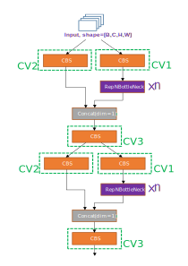

# 语言 Language

[English](./structure.md) [简体中文](structure_CN.md)

# 论文总结

论文提出了PGI（Programmable Gradient Information）思想，即反向传播过程梯度信息丢失的问题需要以被解决。一共提出三个重要部分：

* **辅助可逆分支**（Auxiliary Reversible Branch）

  通过引入可逆结构来保证完整的信息，但在可逆结构中增加backbone参数量会消耗大量的推理成本。作者提出观点：“可逆”并不是推理阶段的唯一必要条件，因此设计了辅助可逆分支，在训练过程中帮助backbone更好地获得丰富的返回梯度信息，使得backbone具有更高的表现；而在推理过程中丢弃该分支，使得推理过程并没有增加时间损耗。该模块仅在**训练模式**使用。 

  

* **多级辅助信息**（Multi-level Auxiliary Information ）

  每个特征金字塔应该接收所有目标对象的梯度信息，然后将包含所有目标对象的梯度信息进行多级辅助信息聚合，传递给主分支进行权重的更新。该模块仅在**训练模式**使用，因为其返回的梯度从辅助可逆分支中获取。 

* **GELAN 模块**

  GELAN模块主要由CSPNet和ELAN结构组合而成，并参考了Re-parameter方法。
  
  GELAN = CSPNet + ELAN

# 模型结构概览

## 训练阶段模型结构

该结构基于 `models/detect/yolov9.yaml`.

|  |  |
| :----------------------------------------------------------: | :----------------------------------------------------------: |
|                    Train model structure                     |               Train model structure (in paper)               |

***辅助可逆分支***  和 ***多级辅助信息***  仅在训练模式存在，用于帮助backbone获得更好的表现。在训练阶段，共有6个输出特征图，如上图中的[16, 19, 22, 31, 34, 37]，这6个输出特征图送入 Detect head 后即可得到预测label。相较于先前的yolo，额外的 [31, 34, 37] 输出得到的更多label能够与 GT label 计算损失后，从辅助可逆回路中将梯度信息更好地传入[#5, #7, #9] 模块中，更新backbone的权重。

## Inference model structure

该结构基于 `models/detect/gelan.yaml`。事实上，该模型基于 `models/detect/yolov9.yaml`在结构上减去辅助分支而得来。

```python
Note:
     models/detect/gelan.yaml   <--->   models/detect/yolov9.yaml 
    models/detect/gelan-c.yaml  <--->  models/detect/yolov9-c.yaml
    models/detect/gelan-e.yaml  <--->  models/detect/yolov9-e.yaml
```


在推理模式下，模型结构与以前的yolo版本相似。注意re-parameter和GELAN块。

通过Detect Head(主要是NMS和其他一些操作)可以得到目标检测结果。

### Blocks 细节

* **Silence** `models.common.Silence`: 该模块输出=输入，即什么都不做。这个模块的目的是为了辅助可逆分支能够获得原图信息。

* **CBS **`models.common.Conv`: Conv2d + BatchNorm2d + SiLU (默认激活函数)

  Note: BN层在推理阶段可以将其参数融合进卷积层。在yolov9的代码中可以关注 ’fuse‘关键词，一般与rep有关，例如`models.common.Conv.forward_fuse`。(ref: [RepVGG](https://openaccess.thecvf.com/content/CVPR2021/papers/Ding_RepVGG_Making_VGG-Style_ConvNets_Great_Again_CVPR_2021_paper.pdf))

* **ELAN** `models.common.RepNCSPELAN4`: 

  从模块名字不难看出核心是Re-parameter + CSPNet + ELAN。

  |  |  |
  | :----------------------------------------------------------: | :----------------------------------------------------------: |
  |                      RepNCSPELAN4 Block                      |               RepNCSPELAN4 （GELAN in paper）                |
  |  |              |
  |                        RepNCSP Block                         |                        RepNBottleNeck                        |

* **ELAN-SPP** `models.common.SPPELAN`:

   该模块与早前yolo版本中的SPPF结构基本一致，如下图。
   
   

* **ADown `models.common.ADown`:**

  该模块在`yolov9-c.yaml`与`yolov9-e.yaml`结构中出现，替代了模型中部分`CBS`模块。

  

---

才疏学浅，如有错误还请指正： luyuxi19970822@163.com
